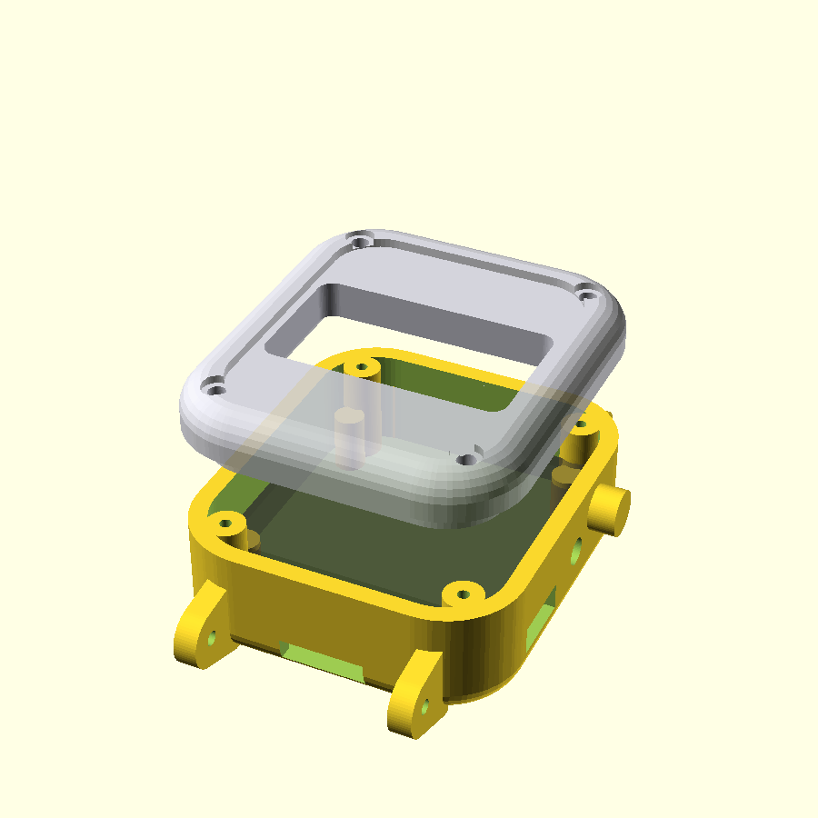

# Glove wrist unit — watch-style enclosure

A 3D-printable, two-part wrist case for the glove electronics, styled after the
reference `frame.stl` (an Apple-Watch-like squircle: ~43 × 49 mm face, rounded
"pillow" edges, side crown + button). The reference is a solid styling shell —
this is the functional version: hollow, holds the boards, and has a display
window, USB access, and a flex-cable entry.

The body is built as a squircle prism **Minkowski-rounded by a sphere**, so every
outer edge (top, back, vertical corners) is filleted into one smooth pillow like
the reference, while the side walls stay flat and the shell stays a uniform
thickness. The face is a flat, recessed **rounded-rectangle "glass" area** (no
cosmetic round ring) with the OLED window in it — Apple-Watch style.



## What it fits

| Part | Size used | Where |
| --- | --- | --- |
| SH1106 1.3" OLED (128×64) | board 35×33, active 29×15.5 | top, behind the window |
| ESP32-C3 SuperMini | 22.5×18×6, USB-C on short end | mid layer, USB to +X side slot |
| MPU6050 (GY-521) | 21×16×3 | floor, mounted rigidly (tracks the wrist) |
| LiPo 502535 | 5×25×35 | floor pocket |
| Flex-sensor ribbon | ~11×3 slot | −Y end (palm side) |

Wrist band: **Apple-Watch-style lugs** with a quick-release spring-bar channel
(default 24 mm / 42-45-49 family — see Assembly step 6).

Outer footprint matches the reference (43 × 49 mm). **Thickness is 21 mm, not the
reference's 14.4 mm:** a 1.3" OLED + ESP32-C3 + 5 mm battery genuinely needs the
extra room to stack. The pillow form (rounded edges) makes it *read* much thinner
than a flat-topped box of the same height. To get closer to the reference
profile, use a 0.96" OLED and a 302030 battery and set `case_h = 16`.

## Files

- `watch_case.scad` — the parametric source (edit the variables at the top).
- `base.stl`, `lid.stl` — ready-to-slice parts (regenerate after editing).
- `preview.png`, `section.png` — renders.

## Render / export

```bash
openscad -o base.stl -D 'part="base"' watch_case.scad
openscad -o lid.stl  -D 'part="lid"'  watch_case.scad
# previews:
openscad -o preview.png --viewall --autocenter watch_case.scad            # exploded + ghost parts
openscad -o section.png -D 'part="section"' --viewall --autocenter watch_case.scad
```

`part` accepts `base`, `lid`, `preview` (default, lid lifted off with translucent
component placeholders), or `section` (cutaway).

## Key parameters (top of `watch_case.scad`)

| Var | Default | Meaning |
| --- | --- | --- |
| `W`, `L`, `case_h` | 43, 49, 21 | outer width / length / thickness (mm) |
| `corner_r` | 10 | squircle vertical corner radius |
| `edge_r` | 4.0 | 3D fillet on all outer edges (the pillow roundness) |
| `lid_cap` | 6.0 | height of the domed top cap = the lid |
| `wall`, `floor_th`, `lid_th` | 2.4, 2.0, 2.0 | shell thicknesses |
| `fit_gap` | 0.25 | lid↔base print clearance — widen if the lid is tight |
| `oled_*`, `esp_*`, `mpu_*`, `batt_*` | — | component sizes; edit to your exact parts |
| `aw_large`, `band_w` | true, 24 | Apple band size: true=42/44/45/49 (24mm), false=38/40/41 (20mm) |
| `bar_d`, `bar_z` | 1.9, 6.0 | spring-bar hole dia / height above the back |
| `crown_d`, `btn_d` | 6, 3.6 | cosmetic crown / button-access hole |

Everything downstream (ledge heights, window, screw bosses, lugs) is derived, so
changing a component size re-fits the case automatically.

## Assembly

1. **MPU6050** flat on the floor, glued/screwed down hard — any play shows up as
   accel/gyro noise.
2. **Battery** in the floor pocket; **ESP32-C3** above it with the USB-C port at
   the +X side slot (for charge/flash without opening the case).
3. **OLED** rests on the four corner ledges, glass just under the window.
4. Route the 5 flex taps + 3V3 + GND ribbon in through the −Y (palm-side) slot.
   The flex divider resistors live on the back-of-hand junction board, not in
   here (see `firmware/COMMS_TESTING.md` / earlier wiring notes).
5. Drop the **lid** in (lip aligns it) and fix with 4× M2 self-tapping screws
   into the corner bosses; heads countersink flush on top.
6. **Band:** the lugs are Apple-Watch style with a through spring-bar channel.
   Use an Apple-Watch band that has **quick-release pins**, or a cheap
   "Apple Watch → spring bar" adapter for Apple's first-party slide-lock bands.
   Default gap is 24 mm (42/44/45/49 family); set `aw_large = false` for the
   38/40/41 (20 mm) family. Apple's native metal slide-lock is intentionally not
   reproduced — it needs the band's spring mechanism and won't print reliably.
   Tune `band_w` / `bar_z` to your physical band and reprint just one end with
   `-D 'part="base"'` cropped, or do a quick caliper check before the full print.

## Print notes

- Base prints open-side up (no supports). Lid prints face-down (glass side on the
  bed) so the flat recessed face comes out clean; the rounded top then needs no
  supports and the countersinks self-support.
- PETG/ABS for a wearable that flexes; PLA is fine for a prototype.
- Both STLs verified watertight (0 non-manifold edges, single connected solid).

## Deviations from the reference (on purpose)

- **Thicker** (21 vs 14.4 mm) to hold real components — see above. The pillow
  edges keep it looking watch-like despite the height.
- **Flat rectangular glass face** instead of the reference's round front boss:
  the SH1106 is rectangular, so the face is a recessed rounded-rect "screen" with
  the OLED window in it. Switch to a round GC9A01 display for a fully round face
  (needs a firmware driver change away from U8G2/SH1106).
- **Crown is cosmetic**; the rectangular side hole is the functional button
  (wire it to EN/reset or a GPIO as you like).
